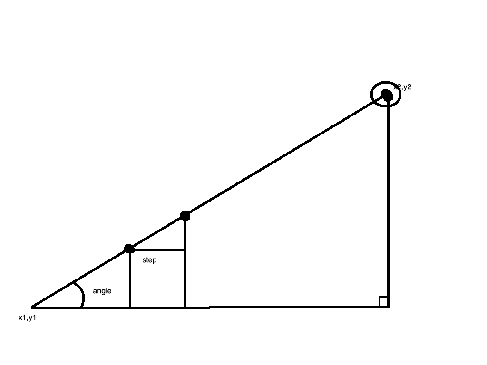
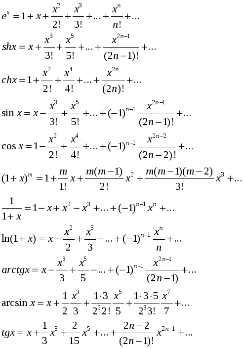

# МИПиС
## mod-lab10-ufo


## Lab 10. Моделирование движение по прямой с вычислением угла

Срок выполнения работы: **по 2 июня**

 -->

**Цель работы:** научиться создавать приложения Windows Forms с использованием элементов графики, моделировать движение объектов по экрану между двумя точками.

## Описание работы

Движение на плоскости между двумя точками с координатами **(x1,y1)** и **(x2,y2)** может быть организовано двумя способами

- с использованием вычислений по уравнению прямой **y = kx + b**

```cpp
void Line(int x1,int y1,int x2,int y2) {
   double k=((double)(y2−y1))/(x2−x1); 
   double b=y1−k*x1;
   for(int x=x1;x<=x2;x++)
      DrawPoint(x,round(k*x+b));
} 
```
В приведенном примере, функция **DrawPoint** рисует точку (объект) в точке с текущими координатами. Расчет ведется в вещественных числах, но округляется при вызове функции рисования.

- с использованием значения угла между одной из осей и направлением на конечную точку



Мы сначала вычисляем угол "на цель", потом приращения по горизонтальной и вертикальной осям. В цикле происходит измнение значения **(x,y)**, до тех пор, пока объект "не войдет" в зону конечной точки. 

```cpp
angle = Atn(Abs(y2 - y1) / Abs(x2 - x1));
...
x=x1;
y=y1;
while(distance>value)
{
   x += step * Cos(angle));
   y -= step * Sin(angle));
   DrawPoint(x,y);
   distance = ....
}
```
Данный способ расчета предполагает наличие погрешности, которая накапливается при суммировании координат. Погрешность вызывается снижением точностью расчетов тригонометрических функций.


## Выполнение работы

Необходимо смоделировать движение объекта из одной точки в другую с учетом погрешности расчетов. Написать свои реализации тригонометрических функций с учетом суммирования ограниченного количества членов ряда **n**.



Расположить точки на значительном расстоянии друг от друга и провести расчет параметров модели с заданной погрешностью.

Чтобы отобразить на форме удаленные на значительное расстояние точки, рекомендуется изменить масштаб холста.


```csharp
g.ScaleTransform(0.5f, 0.5f);
```

Рассчитать, при какой точности расчета тригонометрических функций, точка перестает попадать в заданную окрестность.

Построить график зависимости точности расчетов (количество членов ряда) от радиуса зоны попадания вокруг **(x2,y2)** и сохранить его в файле **dia.png**


## Результаты работы

В качестве результатов работа необходимо загрузить решение VS с файлами, имеющими следующие расширения (строго!)

- **.cs**
- **.resx**
- **.settings**
- **.config**
- **.csproj**
- **.sln**
- **.txt**
- **.png**

Исполняемые, бинарные, временные файлы загружать не нужно!

График в виде изображения с именем **dia.png**в корень репозитория.

**Примечание**. В данной работе не требуется писать тесты.
